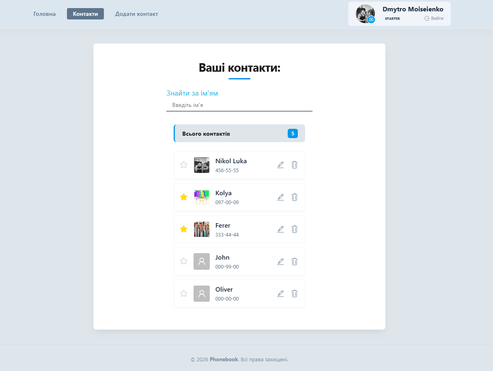

# Phonebook

## Project Description

**Phonebook** is a comprehensive contact management application. It allows users to securely store
and organize their contact lists, create new entries, assign roles, define importance, manage
statuses, and upload photos for both user profiles and individual contacts.

### Key Features:

- **Authentication & Authorization:** Secure registration and login system.
- **Contact Management:** Create and manage contacts with detailed information including name, phone
  number, "Favorite" status, and contact photos.
- **User Profile Customization:** Support for user avatars and tiered account statuses (**Standard,
  Pro, Vip**).
- **Email Verification:** Integrated verification system to ensure valid user email addresses and
  enhance security.

## Technical Specifications

**Live Demo:** [https://phonebook-alpha.vercel.app/](https://phonebook-alpha.vercel.app/)

### Core Technologies:

- **Frontend:** React with React Router for seamless navigation.
- **State Management:** Redux for predictable data flow.
- **Styling & Assets:** Optimized image handling and responsive design.
- **Security:** Verified email protocols and secure token-based sessions.
