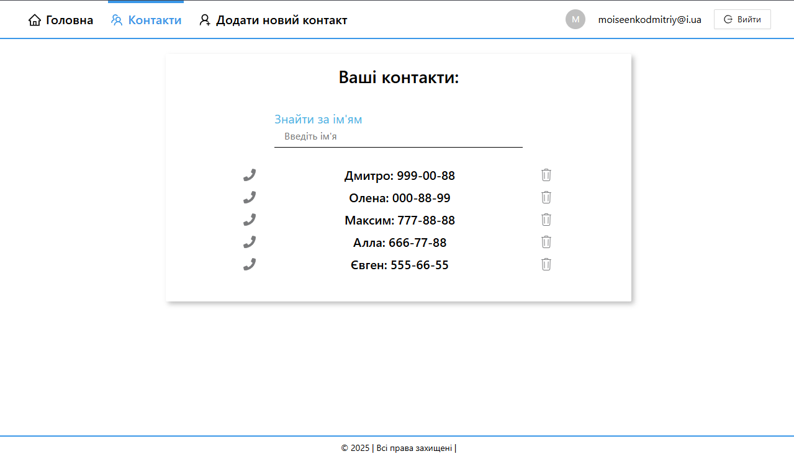

# Phonebook

## Опис проекту

`Phonebook:` Можливість зберігати та організовувати свій список контактів, створювати нові контакти,
визначати їхні ролі та важливість, також змінювати їх статуси, додавати фотографії user та самим
контактним номерам.

`Основні функції:`

- Реєстрація та Авторизація.
- Cтворення нових контактів, включаючи ім'я, номер телефону, додавання до улюблених та фотографій.
- Додавання фотографії user, статусу (Standart, Pro, Vip).
- Верифікація електронної пошти, щоб забезпечити, що адреси користувачів є дійсними.

## Технічні характеристики

`Посилання на сайт:` https://phonebook-alpha.vercel.app/
